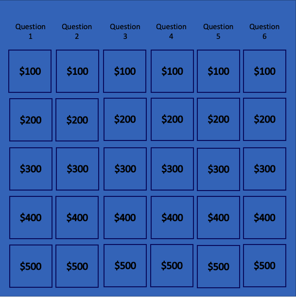

# Project Proposal

## Project Choice 

Trivia (Self-scoring)

## Project Description 

My app is called Leopardy. It's a game app for players who want to play a trivia about animals but mostly cats. Two or more players can get together and enjoy a rousing game of trivia, with the score being kept automatically and game results displayed during and at then end of the game. In the future, I'd like to add a feature the users can choose all the categories. 

## Wire Frames

**Initial Landing View**

## User Stories

#### MVP Goals

- As a player, I want my game to add points together and display it.
- As a player, I would like to know whose turn it is so that I don't have to keep track.
- As a player, I would like to hear or see some sort of indication that my selection was taken. 
- As a player who requires assistive technologies, I would like accessibility features so that I'm not left out of enjoying the game.
- As a player I would like to be able to restart the game and regenerate new questions after a win or loss.
- As a player, I want the UI to be engaging and out of the way so that I enjoy the experience of playing the game.\*\*

#### Stretch Goals

- As a player, I would like a victory animation when I win the game, so that I feel good about my victory!
- As a player I would like to have a timer so none of the players could take too long.
- As a player I would like to hear a song when someone is taking a long time.

## Ideas

# User Experience
* Song begins to play 
" Welcome to Leopardy!"  * Anouncer says this *
* the heading pops up first
* then zooms to the top of the screen

* the categories are next to fill in from left to right in a wave
* at the same time the timer and teams fill in.
- team 1 on left, team 2 on right.
- option to be able to name the teams

* click a number to get started 
- at this time the timer will begin 
- at the end og the end of the time the answer will appear.
- a question will pop up "did they get the answer right? yes? no?"
- points will be added accordingly.

* the box will darken after a question has been selected.
* at the end the winner will get a gif of the 'but im not a rapper' guy
- with the team name at the bottom.